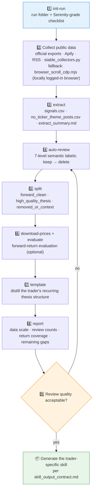

# 🏭 X Trader Skill Builder

[简体中文](README.md) | **English**

> Turn any public X/Twitter trader's post history into a trader-specific research-model skill: a nine-step `init-run → collect → extract → auto-review → split → evaluate → template → report` pipeline, from noisy posts to a reusable agent-skill package.


---

## 📖 What This Is

`x-trader-builder` is a **skill factory**: it generalizes the MVP workflow of [`skill-serenity-research-model`](https://github.com/quantskills/skill-serenity-research-model) — clean noisy public posts, label semantic intent, isolate forward-looking signals, distill a high-quality thesis template, and finally produce a new trader-specific agent skill following the contract in `references/skill_output_contract.md`.

Two instances have been produced / calibrated with this workflow:

| Instance | Coverage |
| --- | --- |
| 🛰️ [`skill-serenity-research-model`](https://github.com/quantskills/skill-serenity-research-model) | AI / semiconductor supply chain (methodology prototype) |
| 🔭 [`skill-gaetano-crux-capital-research-model`](https://github.com/quantskills/skill-gaetano-crux-capital-research-model) | Photonics / optical networking / Physical AI / AI infrastructure |

---

## ⚡ Build Pipeline



---

## 🗂️ CLI Subcommands × Outputs

| Subcommand | Purpose | Key outputs |
| --- | --- | --- |
| `init-run` | Initialize a real-data run folder | checklist + `sources/` + `outputs/` |
| `extract` | Extract raw signals from post exports | `signals.csv` · `no_ticker_theme_posts.csv` · `extract_summary.md` |
| `auto-review` | Semantic labeling | `signals_auto_reviewed.csv` (7-level labels) |
| `split` | Split the dataset by label | `signals_forward_clean.csv` · `signals_high_quality_thesis.csv` · `signals_removed_or_context.csv` · `semantic_filter_summary.md` |
| `download-prices` | Fetch prices for signals | price dir (`<TICKER>.csv`) |
| `evaluate` | Forward-return evaluation | `signal_evaluation.csv` |
| `template` | Distill the thesis template | trader thesis structure (trend · chain position · mispricing · evidence · catalyst · risk · tracking) |
| `report` | Write the real-data MVP report | data scale, review counts, coverage, remaining gaps |

---

## 🚀 Quick Start

### 1️⃣ Install

```bash
# Claude Code (global)
cp -r skill-x-trader-builder ~/.claude/skills/x-trader-builder
```

For Codex / OpenClaw-style platforms, import with the `SKILL.md` + `references/` + `scripts/` + `collectors/` structure intact; `agents/openai.yaml` provides the OpenAI/Codex adapter.

### 2️⃣ Trigger examples

```text
Use x-trader-builder to build a research-model skill for @some_trader
Run extract and auto-review on this post export and show me the semantic filter summary
Run a forward-return evaluation on the high_quality_thesis signal set
```

### 3️⃣ End-to-end example

```bash
python scripts/x_trader_builder.py init-run        --trader "Some Trader" --trader-slug some-trader --out real_runs
python scripts/x_trader_builder.py extract         --posts posts.csv --trader "Some Trader" --trader-slug some-trader --out real_runs/some-trader/outputs/raw_extract
python scripts/x_trader_builder.py auto-review     --signals .../signals.csv --out .../reviewed
python scripts/x_trader_builder.py split           --reviewed .../signals_auto_reviewed.csv --out .../split
python scripts/x_trader_builder.py download-prices --signals .../signals_forward_clean.csv --out prices --limit 40
python scripts/x_trader_builder.py evaluate        --signals .../signals_forward_clean.csv --prices prices --out .../forward_clean_eval
python scripts/x_trader_builder.py template        --signals .../signals_high_quality_thesis.csv --trader "Some Trader" --out .../template
python scripts/x_trader_builder.py report          --signals .../signals_auto_reviewed.csv --evaluation .../signal_evaluation.csv --trader "Some Trader" --out .../report
```

The repo ships `scripts/sample_signals.csv` for a dry run.

---

## 📦 Repository Layout

```text
skill-x-trader-builder/
├── SKILL.md                              # Skill entrypoint: 9-step workflow + interpretation rules + git hygiene
├── scripts/
│   ├── x_trader_builder.py               # 🐍 init-run/extract/auto-review/split/download-prices/evaluate/template/report
│   └── sample_signals.csv                # 🧪 sample signals for a dry run
├── collectors/
│   ├── stable_collectors.py              # 📡 stable collection/normalization (official exports, Apify, RSS)
│   └── browser_scroll_cdp.mjs            # 🌐 CDP scroll-capture fallback via a locally logged-in browser
├── references/
│   ├── data_contract.md                  # 📋 Signal-table field contract + 7-level label definitions
│   ├── review_rules.md                   # 🏷️ Semantic review rules
│   └── skill_output_contract.md          # 📦 Minimum file contract for generated trader skills
└── agents/
    └── openai.yaml                       # OpenAI/Codex adapter
```

---

## 📐 Core Constraints

| Constraint | Detail |
| --- | --- |
| 🌐 Collection priority | Official API / user-owned exports / managed scrapers / RSS first; DIY X-page scraping is a last-resort fallback treated as partial capture |
| 🧾 Posts ≠ audited P&L | Public posts are research artifacts, never audited performance |
| ✂️ Own words vs quotes | Tickers appearing only in quoted context never count as the trader's forward signals |
| 🕰️ Retrospective ≠ forward | Track-record claims never enter the forward signal set |
| ⚖️ Deweight, don't delete | Watchlists, crowdsourced lists, and broad baskets are kept but deweighted |
| 📦 Generated skills stay lean | No raw exports, large CSVs, or price histories bundled; SKILL.md + references only |
| 🚫 Describe, don't recommend | Outputs are research structure and fact synthesis, never investment advice |

---

## ⚠️ Disclaimer

This tool organizes and models public materials at the research-method level only. It does not verify any performance claims and does not constitute investment advice.

## 📜 License

This project is licensed under the GNU General Public License v3.0. See [LICENSE](LICENSE).
