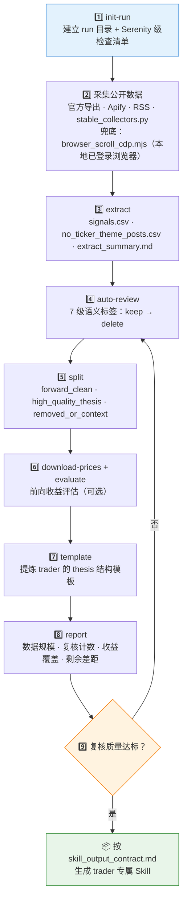

# 🏭 X Trader Skill Builder

**简体中文** | [English](README.en.md)

> 把任意 X/Twitter 公开交易员的发帖历史，加工成 trader 专属的研究模型 Skill：`init-run → 采集 → extract → auto-review → split → evaluate → template → report` 九步流水线，从噪声帖子到可复用的 Agent Skill 包。


---

## 📖 这是什么

`x-trader-builder` 是一个**Skill 工厂**：它把 [`skill-serenity-research-model`](https://github.com/quantskills/skill-serenity-research-model) 的 MVP 工作流通用化——清洗嘈杂的公开帖子、标注语义意图、隔离前瞻信号、提炼高质量 thesis 模板，最终按 `references/skill_output_contract.md` 的契约，产出一个新的 trader 专属 Agent Skill。

已有两个由这套工作流产出 / 校准的实例：

| 实例 | 赛道 |
| --- | --- |
| 🛰️ [`skill-serenity-research-model`](https://github.com/quantskills/skill-serenity-research-model) | AI / 半导体供应链（方法论原型） |
| 🔭 [`skill-gaetano-crux-capital-research-model`](https://github.com/quantskills/skill-gaetano-crux-capital-research-model) | 光子 / 光网络 / Physical AI / AI 基础设施 |

---

## ⚡ 构建流水线



---

## 🗂️ CLI 子命令 × 产物

| 子命令 | 作用 | 关键产物 |
| --- | --- | --- |
| `init-run` | 初始化真实数据 run 目录 | 检查清单 + `sources/` + `outputs/` |
| `extract` | 从帖子导出提取原始信号 | `signals.csv` · `no_ticker_theme_posts.csv` · `extract_summary.md` |
| `auto-review` | 语义标注 | `signals_auto_reviewed.csv`（7 级标签） |
| `split` | 按标签拆分数据集 | `signals_forward_clean.csv` · `signals_high_quality_thesis.csv` · `signals_removed_or_context.csv` · `semantic_filter_summary.md` |
| `download-prices` | 拉取信号对应价格 | 价格目录（`<TICKER>.csv`） |
| `evaluate` | 前向收益评估 | `signal_evaluation.csv` |
| `template` | 提炼 thesis 模板 | trader thesis 结构模板（趋势 · 链上位置 · 错误定价 · 证据 · 催化 · 风险 · 跟踪） |
| `report` | 写真实数据 MVP 报告 | 含数据规模、复核计数、覆盖率与剩余差距 |

---

## 🚀 快速开始

### 1️⃣ 安装

```bash
# Claude Code（全局）
cp -r skill-x-trader-builder ~/.claude/skills/x-trader-builder
```

Codex / OpenClaw 等平台：保持 `SKILL.md` + `references/` + `scripts/` + `collectors/` 结构导入；`agents/openai.yaml` 提供 OpenAI/Codex 适配。

### 2️⃣ 触发示例

```text
帮我用 x-trader-builder 给 @某交易员 建一个研究模型 Skill
这份帖子导出先跑 extract 和 auto-review，给我看语义过滤摘要
对 high_quality_thesis 信号集做一次前向收益评估
```

### 3️⃣ 端到端示例

```bash
python scripts/x_trader_builder.py init-run        --trader "Some Trader" --trader-slug some-trader --out real_runs
python scripts/x_trader_builder.py extract         --posts posts.csv --trader "Some Trader" --trader-slug some-trader --out real_runs/some-trader/outputs/raw_extract
python scripts/x_trader_builder.py auto-review     --signals .../signals.csv --out .../reviewed
python scripts/x_trader_builder.py split           --reviewed .../signals_auto_reviewed.csv --out .../split
python scripts/x_trader_builder.py download-prices --signals .../signals_forward_clean.csv --out prices --limit 40
python scripts/x_trader_builder.py evaluate        --signals .../signals_forward_clean.csv --prices prices --out .../forward_clean_eval
python scripts/x_trader_builder.py template        --signals .../signals_high_quality_thesis.csv --trader "Some Trader" --out .../template
python scripts/x_trader_builder.py report          --signals .../signals_auto_reviewed.csv --evaluation .../signal_evaluation.csv --trader "Some Trader" --out .../report
```

仓库自带 `scripts/sample_signals.csv` 可用于干跑验证流程。

---

## 📦 目录结构

```text
skill-x-trader-builder/
├── SKILL.md                              # 技能入口：九步工作流 + 解释规则 + Git 卫生
├── scripts/
│   ├── x_trader_builder.py               # 🐍 init-run/extract/auto-review/split/download-prices/evaluate/template/report
│   └── sample_signals.csv                # 🧪 干跑用样例信号
├── collectors/
│   ├── stable_collectors.py              # 📡 官方导出 / Apify / RSS 等稳定采集与归一化
│   └── browser_scroll_cdp.mjs            # 🌐 本地已登录浏览器的 CDP 滚动采集兜底
├── references/
│   ├── data_contract.md                  # 📋 信号表字段契约 + 7 级标签定义
│   ├── review_rules.md                   # 🏷️ 语义复核规则
│   └── skill_output_contract.md          # 📦 生成 trader Skill 的最小文件契约
└── agents/
    └── openai.yaml                       # OpenAI/Codex 适配
```

---

## 📐 核心约束

| 约束 | 说明 |
| --- | --- |
| 🌐 采集优先级 | 官方 API 导出 / 用户自有导出 / 托管抓取 / RSS 优先；DIY 抓取 X 页面是最后兜底，且按「不完整采集」对待 |
| 🧾 帖子 ≠ 审计 P&L | 公开帖子是研究素材，不当作经审计的业绩 |
| ✂️ 引用与本人观点分离 | ticker 仅在引用上下文出现时不计入该交易员的前瞻信号 |
| 🕰️ 历史战绩不当前瞻 | 回顾性回报声明永不进入前瞻信号集 |
| ⚖️ 加权而非删除 | watchlist、众包清单、宽泛篮子保留但降权 |
| 📦 生成的 Skill 要轻 | 不打包原始导出、大型 CSV、价格历史；只带 SKILL.md + references |
| 🚫 只述不荐 | 输出研究结构与事实归纳，不构成任何投资建议 |

---

## ⚠️ 免责声明

本工具仅用于对公开材料做研究方法层面的整理与建模，不验证任何收益声明，不构成任何投资建议。

## 📜 License

This project is licensed under the GNU General Public License v3.0. See [LICENSE](LICENSE).

## 🐼 PandaAI / QUANTSKILLS 社群

<div align="center">
  
  <br>
  <sub>扫码加入 PandaAI 社群，交流 QUANTSKILLS 技能、Agent 工作流与量化研究实践。</sub>
</div>
